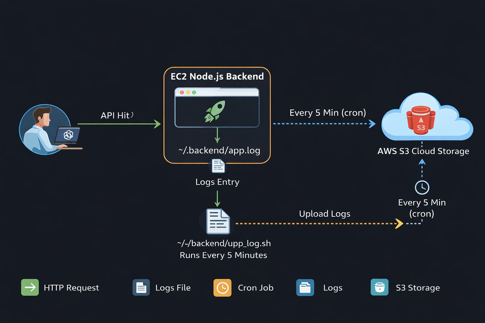

# Node.js API Logging and Upload to AWS S3

## 📌 Project Overview
This project demonstrates a simple Node.js backend application built using Express.  
Every time an API endpoint is hit, the request is logged into a file.  
The application runs on an AWS EC2 instance, and the generated log file is automatically uploaded to an Amazon S3 bucket using a Linux shell script and cron job.

---
## 🏗 Architecture Diagram

## ⚙️ How the Project Works

- A client or browser sends a request to the API endpoint  
- The request reaches the Node.js server  
- Express handles the request  
- Each API hit is written into a log file (`app.log`)  
- A cron job runs a shell script at regular intervals  
- The shell script uploads the log file to an S3 bucket  

---

## 🎯 Purpose of This Project

- Understand how Node.js handles HTTP requests  
- Learn Express routing  
- Practice file-based logging  
- Use Linux shell scripting and cron jobs  
- Integrate AWS EC2 with Amazon S3  

---

## 📂 File Explanation

### app.js
Main Node.js application file. It runs the Express server and writes API hit logs into `app.log`.

### upload_log.sh
Shell script that uploads the log file from EC2 to the S3 bucket.

### package.json
Contains project metadata and required dependencies such as Express.

### package-lock.json
Automatically generated by npm. Locks exact dependency versions for consistent builds.

### .gitignore
Prevents unnecessary files like `node_modules` and log files from being pushed to GitHub.

---

## ☁️ AWS Services Used

- Amazon EC2  
- Amazon S3  
- IAM Role  

---

## 👨‍💻 Author
Subham Badatya
